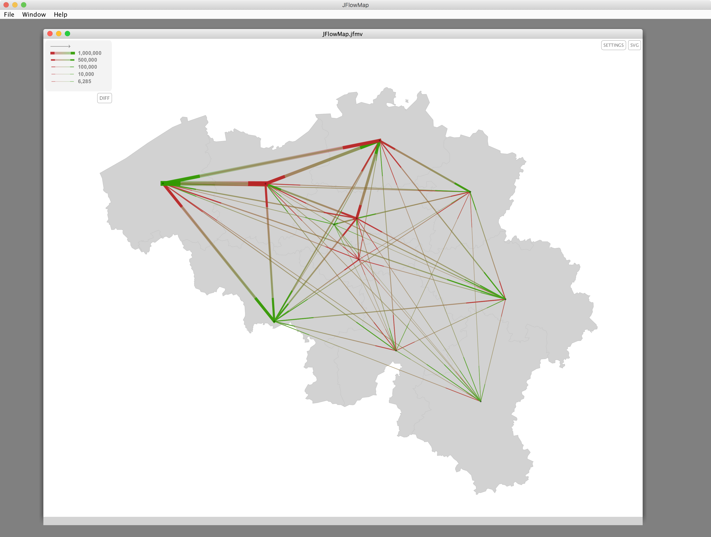

#JFlowMap companion application

[JFlowMap](http://www.visualisingdata.com/resources/jflowmap/) is a research prototype developed
at the University of Fribourg in which one experiment with  various visualization techniques for spatial
 interactions, i.e. interactions between pairs of geographic locations. These can be migrations, 
 movement of goods and people, network traffic, or any kind of entities "flowing" between locations. 

Spatial interactions are often represented as origin-destination data, meaning that only the origins, 
the destinations and the magnitudes of the flows are known, but not the exact flow routes.

The goal of the work is to develop a tool which would help to explore and analyze temporal changes 
in origin-destination data. 

JFlowMap can therefore be used to visualize the flows of origin-destination matrixes used by Nodus. The
example *JFlowMap.groovy* script can be used to prepare data for JFlowMap. Run the script
from within the Nodus "demo" project.

A *JFlowMap.jfmv* file will be created in the project's directory. Launch JFlowMap and open the .jfmv file. 

 

You'll just have to modify the OD table name and the background shapefile name in the Groovy script
if you want to use JFlowMap with another Nodus project.
      