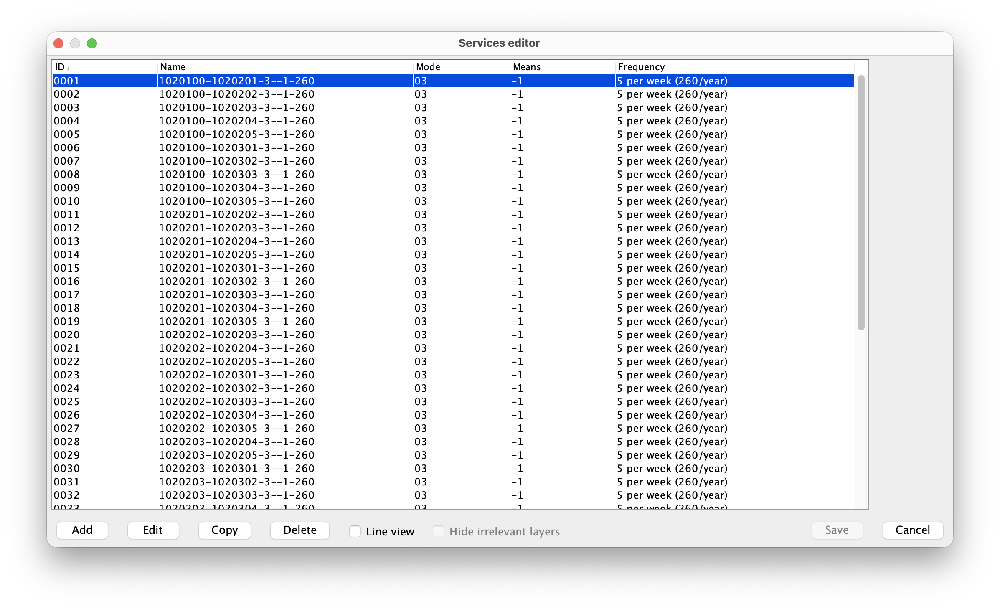
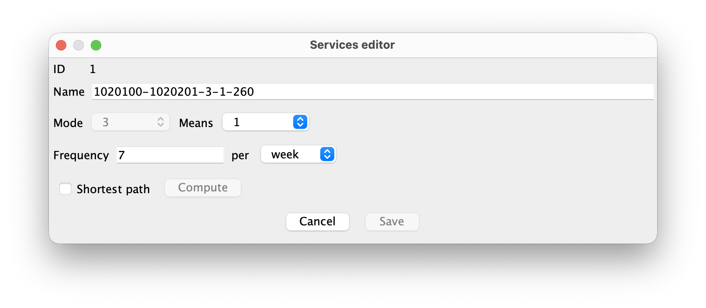
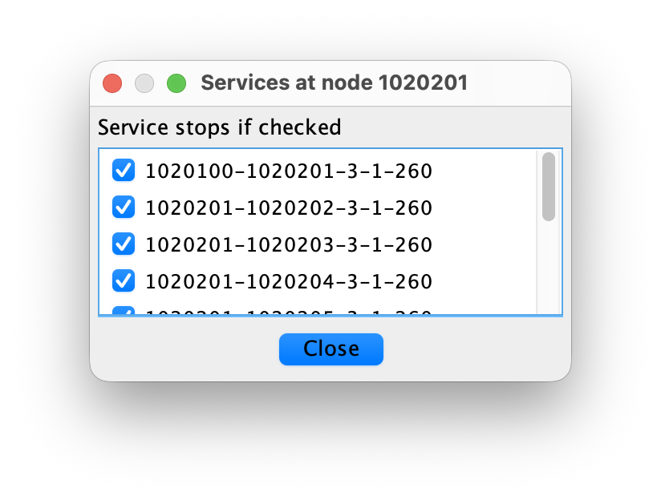
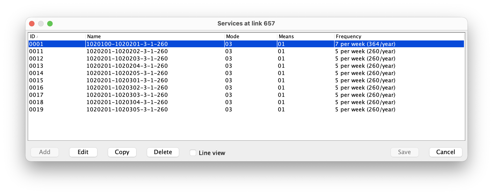

# Service Lines Workflow

This document explains how to create, edit, and use transport services in Nodus.

## Main Concepts

A service describes a scheduled transport line on top of the physical network. A service has:

- an ID and a name,
- one mode and either one means or `-1` for all means supported over the complete line,
- an annualized frequency, edited as a number per year, month, week, or day,
- a connected set of network links,
- optional stop nodes along those links.

When a mode/means combination is declared as service-constrained, traffic for that mode/means can only use links that belong to a defined service. This is controlled in the cost functions file with:

```properties
SERVICELINES.mode,means = true
```

For example:

```properties
SERVICELINES.3,2 = true
```

This constrains only mode 3, means 2. Other means of mode 3 remain unconstrained unless they also have their own `SERVICELINES.mode,means` entry.

Use `-1` as a wildcard to constrain every positive means of a mode:

```properties
SERVICELINES.3,-1 = true
```

A concrete entry overrides the wildcard for that mode. For example, adding `SERVICELINES.3,2 = false` leaves means 2 unconstrained while the other means of mode 3 remain constrained.

For constrained combinations, the virtual network is generated per service. A real link only receives virtual movement links for services that use that link and whose service means matches the generated means. A service with means `-1` is expanded into separate virtual-network layers for every concrete means supported by every link of its complete line. All those links must be enabled. If the smallest `means` value among its links is 3, the service is generated for means 1, 2, and 3. If one of its links is disabled, no incomplete variant of the service is generated, but the stored service definition is retained. The generated virtual nodes and tables always contain concrete positive means; `-1` remains limited to the service definition. Unconstrained mode/means combinations are generated in the usual free-flow way, with service ID 0.

All concrete variants of a wildcard service share its service ID, stops, and annualized frequency. Moving from one means to another without changing service remains a transhipment, even when both means are variants of the same wildcard service.

This ordered, service-aware representation is called **Virtual Network Version 4**. It extends Version 3 by retaining the position of every physical-link occurrence along a service route and by representing stops and service switches explicitly. This prevents an assignment path from bypassing a selected intermediate stop, including a stop reached and left over the same connector.

## Services Editor

Open the services editor from the Project|Edit services menu (or use F3).



The upper table lists the existing services. The columns are:

- ID: numeric identifier of the service,
- Name: service name,
- Mode: transport mode used by the service,
- Means: transport means used by the service; `-1` means all means supported over the complete line,
- Frequency: service frequency, shown in the most readable period and with the equivalent annual value.

Use the buttons at the bottom of the dialog to manage the list:

- Add creates a new service.
- Edit opens the selected service for editing. A double-click on a service has the same effect.
- Copy duplicates the selected service.
- Delete removes the selected service.
- Line view hides non-service links on the touched link layers so the selected service can be inspected in isolation.
- Hide irrelevant layers is available only when Line view is checked. It also turns off complete link layers that contain no part of the selected service and node layers that contain none of the service link endpoints. Unchecking either option or closing the dialog restores the previous layer visibility.
- Save writes all pending service changes to the SQL database and closes the dialog.
- Cancel closes the dialog. If there are pending service changes, Nodus asks whether to discard them or save them.

The Escape key has the same effect as Cancel. If an invalid service is loaded from the database, Nodus warns about it and can delete invalid services from the service tables.

## Creating or Editing a Service Line

When a service is added or edited, Nodus switches to the service details view.



The details view lets you edit the name, means, and frequency. The service ID is assigned automatically. The means list uses the same wildcard convention as the node-rules dialog: `-1` means all means supported over the complete line. The details view also activates line editing on the map and switches the map to selection mode.

When a new service is added, Shortest path is checked by default. The checkbox remains enabled until the first route node is selected, so it can be unchecked if the service must be edited manually. During node selection it is disabled to keep the workflow mode stable.

When an existing service is edited, Shortest path is unchecked by default. Leave it unchecked to modify the existing line manually, or check it to replace the whole route with a newly computed shortest-path line. The existing service name, frequency, mode, and means are kept when Shortest path is checked.

To define or edit a service line manually:

1. Uncheck Shortest path if a new service should be edited manually.
2. Select links on the map.
3. The mode is inferred from the first selected link and cannot be typed directly. The means list contains `-1` and the means available for that mode.
4. The selected service line is highlighted in green.
5. Add links one by one. Each new link must extend one of the two ends of the current ordered route.
6. Click an already selected end link to remove it.
7. Press Save in the details view to apply the edited service to the pending service list and return to the service list.
8. Press Save in the main services editor to commit the pending service list to the SQL database.

To create or replace the service line from a computed shortest path:

1. Keep Shortest path checked when adding a new service, or check it explicitly while editing an existing service.
2. Choose the mode and means to use for the computation. Positive values compute the route for that concrete means. With `-1`, the route is computed on means 1, which has the widest link availability, and the completed service is then made available to all means supported over every link of that route.
3. Select the origin node on the map. After this selection, Shortest path is disabled until the workflow ends.
4. Select zero or more intermediate route nodes in the order they must be visited.
5. Select the destination node.
6. Press Compute to replace the edited service line with the concatenated shortest paths between each selected node.
7. Press Save in the details view, then Save in the main services editor.

The service editor displays the number of selected route nodes. The full ordered node sequence is printed in the service log. The selected intermediate nodes are routing waypoints and stops. The service stops created by this workflow are all the selected nodes.

The Save button is enabled only when the edited fields are valid, the service has at least one link, and there are unsaved detail changes. When Save is pressed, Nodus validates the full service line. A valid service line must satisfy these rules:

- the service must contain at least one link,
- all links must use the same mode,
- every link must support the selected concrete means; for means `-1`, the supported range is derived from the complete line,
- the links must be stored in travel order and consecutive link occurrences must share a node,
- a network cycle is not accepted; an out-and-back access branch is accepted when its links occur twice and lead to an intermediate stop,
- all links must belong to one connected component,
- the service must have at least two end nodes,
- every end node must allow operations.

The first link must be connected to at least one node where operations are possible. A service line can also end only at nodes where operations are possible. If a link is removed, stop nodes that are no longer touched by the service are removed from the service.

The Escape key or Cancel button leaves the service details view. If the details contain unsaved changes, Nodus asks whether to discard them or save them. Saving at this level still only applies the service to the pending service list; the SQL tables are written by the main services editor Save button or by choosing Save changes when closing the list.

## Stop Nodes

A stop node is a node where a service is allowed to stop. It is not defined directly by the node `tranship` field. It is stored separately in the services stop table.

To edit stop nodes:

1. Open the database fields editor for a node.
2. Press the Services button.
3. The "Services at node xxx" dialog lists all services that pass through this node.
4. In the list headed "Service stops if checked", check the services that should stop at the node.
5. Press Close in the "Services at node xxx" dialog to apply the checked state back to the DBF editor.
6. Press Save in the fields editor to commit the stop changes to the service SQL tables.



If the fields editor is closed with Cancel or Escape, the staged stop changes are discarded.

## The Services Button in the Fields Editor

For a node, the button is enabled only when the node allows operations and at least one service passes through the node. It opens the "Services at node xxx" dialog, whose list is headed "Service stops if checked". This dialog is used to mark whether each passing service is allowed to stop there.

For a link, the button is enabled only when at least one service uses the link. It opens the "Services at link xxx" dialog. This dialog lists the services that use the link. Selecting a service in the list highlights it on the map.



The Services button does not edit the shape geometry. Node stop edits are staged in the DBF editor, then stored in SQL service tables when the fields editor is saved.

## Transhipment Codes and Service Changes

The node `tranship` field controls which operations are allowed at a node. The fields editor offers these operation types:

| Code | Meaning |
| ---: | --- |
| 0 | No operation |
| 1 | All operations |
| 2 | Transhipment only |
| 3 | Loading/unloading only |
| 4 | Service change only |

Code 4 is specific to services. It means that traffic may switch from one service to another service of the same mode/means at this node, provided that both services also stop at the node.

Examples:

- `tranship = 4` allows service changes, but does not make the node a loading/unloading point.
- `tranship = 1` allows loading/unloading, transhipment, and service changes.
- `tranship = 3` allows loading/unloading, but not service changes.

Codes greater than 4 are interpreted by the virtual-network code as the same operation code minus 5, but with transit links disabled at the node. For example, code 5 behaves like code 0 with transit disabled, code 6 behaves like code 1 with transit disabled, and so on.

## Service Changes, Stops, and Cost Functions

Services add two virtual-link operation types:

- `stp.mode,means`: cost of stopping on a service,
- `sw.fromMode,fromMeans-toMode,toMeans`: cost of switching between services.

If duration functions are used, the equivalent keys are:

```properties
stp@mode,means = ...
sw@fromMode,fromMeans-toMode,toMeans = ...
```

The usual cost functions are still used:

- `mv` for movement,
- `ld` for loading,
- `ul` for unloading,
- `tr` for transit,
- `tp` for transhipment between different mode/means combinations.

Stops affect generated virtual links:

- loading and unloading on a service-constrained mode/means are generated only at nodes where the service stops,
- service switches are generated only between different services of the same mode, at service-change nodes where both services stop; the means may differ,
- stop virtual links use the `stp` cost/duration function,
- service-change virtual links use the `sw` cost/duration function.

A service switch may change means within the same mode. For example, a train service using an electric locomotive can switch to a service using a diesel locomotive where electrification ends, without modelling the operation as cargo transhipment. Switching between different modes remains a transhipment.

When two services of the same mode but different means meet at a node that allows all operations, Nodus generates both alternatives: a service-switch link using `sw` and a transhipment link using `tp`. Their respective cost and duration functions determine which operation an assignment may use. A node configured for service changes only generates the `sw` alternative; a node configured for transhipment only generates the `tp` alternative.

The links of a service form an ordered walk. The virtual network keeps each occurrence of a physical link as a separate route state and connects only consecutive occurrences. Consequently, a route that enters and leaves a dead-end stop over the same connector must store that connector twice, and assignment traffic cannot bypass the stop.

Assignment virtual-network tables store the generated operation in the `vtype` field: `0` moving, `1` transit, `2` loading, `3` unloading, `4` transhipment, `5` service switch, and `6` stop. The virtual-network drawing uses this field to distinguish stop links from transit links. For older tables without `vtype`, the drawing derives stops from the current service-stop table.

When traffic switches service, the cost parser sets the `FREQUENCY` variable to the annualized frequency of the destination service. This allows the `sw` cost or duration function to include a waiting-time component. For links that do not change service, `FREQUENCY` is set to 0.

## Generating Services From an OD Matrix

The bundled [`CreateShortestPathServicesFromOD.groovy`](../../scripts/CreateShortestPathServicesFromOD.groovy) script can generate an initial set of service lines from an OD matrix. Run it from the Nodus Groovy console while the project containing the matrix and physical network is open.

Before running the script, edit these variables near the beginning of the file:

- `odTableName`: name of the OD matrix table,
- `mode`: mode used by the generated services and their shortest paths,
- `means`: means used by the generated services and their shortest paths; use `-1` for all means,
- `frequencyPerWeek`: weekly frequency, which the script converts to the annual frequency stored by Nodus,
- `previewOnly`: optional dry-run switch that leaves the service tables unchanged.

For each distinct unordered origin-destination pair, the script computes the shortest physical path for the selected mode and means. Multiple commodity groups for the same pair do not create duplicate services, and reverse relations such as A-B and B-A are represented by one service. The lower node ID is used first so that the generated name remains stable:

```text
origin-destination-mode-means-annualFrequency
```

Only the origin and destination are initially marked as stops. Additional stops can be selected later with the Services button in the node fields editor. If service tables already exist, the script asks whether the generated services must be added, whether the currently loaded services must first be cleared, or whether the operation must be canceled.

The script uses the public `ServiceHandler` API to create routes and calls `savePendingChanges()` once generation is complete; it does not insert rows directly into the service tables. It therefore needs no update for the ordered `pathidx` schema: the handler stores every physical-link occurrence in route order and migrates an older links table when necessary.

The script also does not create assignment virtual-network tables. Their `vtype` field, including explicit service-switch and stop types, is written later when the virtual network is generated for an assignment.

## Database Tables

Services are stored in three SQL tables. These tables are not part of the shapefile DBF. The default table prefix is:

```text
<project-name>_services
```

It can be changed with the `servicestableprefix` project property, that can be set in the Project|Preferences dialog. With the default prefix, the three tables are:

```text
<project-name>_services_header
<project-name>_services_links
<project-name>_services_stops
```

### Header Table

The header table contains one row per service.

| Field | Type | Meaning |
| --- | --- | --- |
| `id` | `NUMERIC(4,0)` | Service ID |
| `name` | `VARCHAR(30)` | Service name |
| `mode` | `NUMERIC(2,0)` | Service mode |
| `means` | `NUMERIC(2,0)` | Service means, or `-1` for all means supported over the complete line |
| `frequency` | `NUMERIC(5,0)` | Service frequency |

### Links Table

The links table contains the links used by each service.

| Field | Type | Meaning |
| --- | --- | --- |
| `id` | `NUMERIC(4,0)` | Service ID |
| `pathidx` | `NUMERIC(8,0)` | Zero-based position of this link occurrence in the ordered route |
| `link` | `NUMERIC(10,0)` | Link ID |

When an older links table has no `pathidx` field, Nodus loads its rows and rewrites the service tables once in the ordered format.

### Stops Table

The stops table contains the stop nodes of each service.

| Field | Type | Meaning |
| --- | --- | --- |
| `id` | `NUMERIC(4,0)` | Service ID |
| `stop` | `NUMERIC(10,0)` | Node ID where the service may stop |

## Practical Checklist

To create a usable service-constrained network:

1. Define `SERVICELINES.mode,means = true` in the cost functions file for each constrained mode/means, or use means `-1` to constrain every means of a mode.
2. Add the needed `stp` and `sw` cost functions, and duration functions if durations are used.
3. Create services in the services editor.
4. Draw each service line by selecting connected links on the map, or generate it with Shortest path and optional route waypoints.
5. Ensure all service end nodes allow operations.
6. Use the Node fields editor Services button on nodes to mark service stop nodes.
7. Use transhipment code 4 on nodes where service changes are allowed.
8. Save the service details, then save the services editor.
